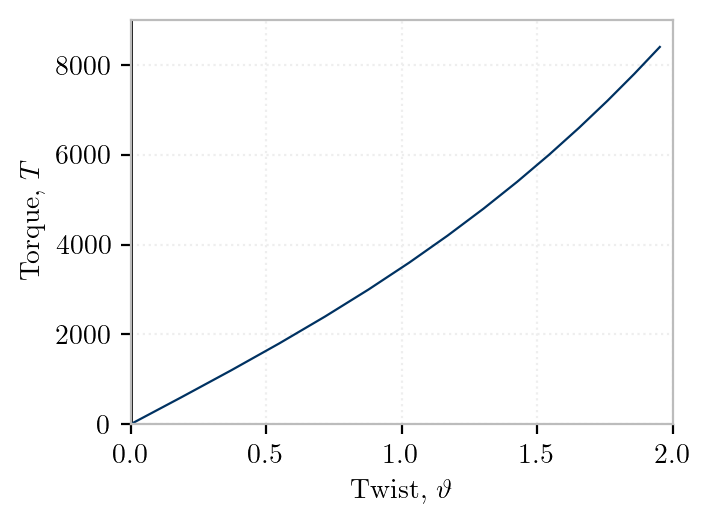

<cite key="trahair2005nonlinear"></cite>

The torque-twist rotation behavior of a cantilever torsion member of narrow rectangular section 
$200 \mathrm{~mm} \times 10 \mathrm{~mm}$ is shown in Fig. 1. 
The member has a concentrated torque $M$ acting at the righthand end and is prevented from rotating at the left-hand support. The beam properties are $G=80,000 \mathrm{MPa}, E=200,000 \mathrm{MPa}, J$ $=66.667 \mathrm{E} 3 \mathrm{~mm}^4, I_w=0 \mathrm{~mm}^6, I_n=17.778 \mathrm{E} 9 \mathrm{~mm}^6$, and length $L$ $=1,000 \mathrm{~mm}$.

This beam is in uniform torsion under a constant torque $M_z$ $=M$, so that the twist $d \phi / d z$ is constant along the member. In this case, Eq. (1) can be solved in closed form as

$$
M=G J \frac{\phi_L}{L}+\frac{1}{2} E I_n\left(\frac{\phi_L}{L}\right)^3
$$

where $\phi_L=$ twist rotation at the free end.

Rectangle, pure torsion (no instability), unconstrained warping, <cite keys="battini2002corotational, rinchen2016formulation"></cite>. 

Nonuniform constrained warping was considered by <cite keys="zhang2011formulation"></cite>

- Wen Yi Lin; Kuo Mo Hsiao. (2001). Co-rotational formulation for geometric nonlinear analysis of doubly symmetric thin-walled beams. , 190(45), 6023–6052. doi:10.1016/s0045-7825(01)00212-2

- @trahair2005nonlinear
- Battini et al. (2002a), example 7.4
- <cite key="du2021threedimensional"></cite>
- rong2020geometrically, <cite key="rong2020geometrically"></cite>



# References

