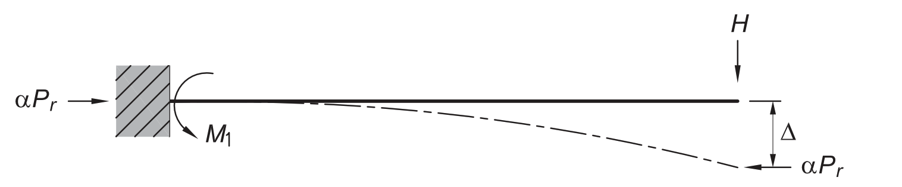
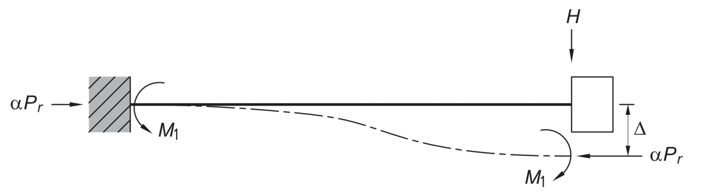
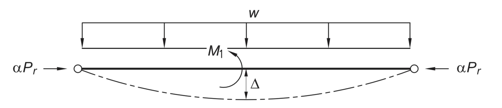
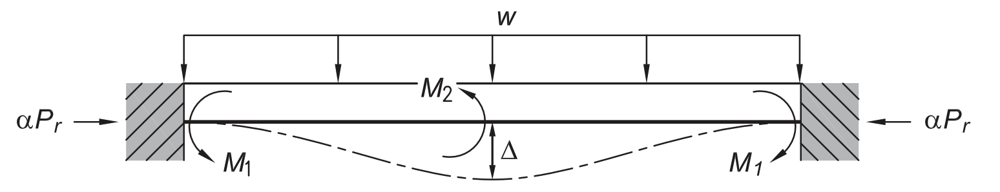
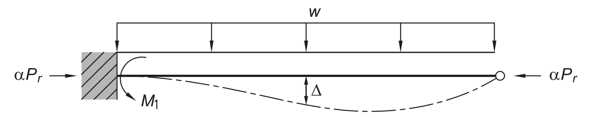

$$
P_{e L} = \frac{\pi^2 E I}{L^2}
\qquad\text{ and }\qquad
\lambda = \frac{\pi}{2} \sqrt{\frac{\alpha P_r}{P_{e L}}}
$$

---

$$
u_y = H L^3/(3 E I) +  H L/(\kappa G A)
$$

$$
u = \frac{H L^3}{3 E I}\left[\frac{3(\tan 2\lambda - 2\lambda)}{(2\lambda)^3}\right]
$$

$$
M = H L\left[\frac{\tan 2\lambda}{2\lambda}\right]
$$

---

$$
u = \frac{H L^3}{12 E I}\left[\frac{3(\tan \lambda - \lambda)}{\lambda^3}\right]
$$
$$
M = \frac{H L}{2}\left[\frac{\tan \lambda}{\lambda}\right]
$$

---

$$
u = \frac{5 w L^4}{384 E I}\left[\frac{12\left(2 \sec \lambda - \lambda^2 - 2\right)}{5 \lambda^4}\right]
$$

$$
M = \frac{w L^2}{8}\left[\frac{2(\sec \lambda - 1)}{\lambda^2}\right]
$$

---

$$
v = \frac{w L^4}{384 E I}\left[\frac{12(2 - 2 \cos \lambda - \lambda \sin \lambda)}{\lambda^3 \sin \lambda}\right]
$$

$$
M = \frac{w L^2}{12}\left[\frac{3(\tan \lambda - \lambda)}{\lambda^2 \tan \lambda}\right]
$$

---

$$
u = \frac{w L^4}{192 E I}\left\{\frac{6}{\lambda^4}\left[(2 \sec \lambda - 2\lambda - 2) - \frac{(\tan \lambda - \lambda)(\sec \lambda - 1)}{\left(\frac{1}{2\lambda} - \frac{1}{\tan 2\lambda}\right)}\right]\right\}
$$

$$
M = \frac{w L^2}{8}\left[\frac{2(\tan \lambda - \lambda)}{\lambda^2\left(\frac{1}{2\lambda} - \frac{1}{\tan 2\lambda}\right)}\right]
$$

-----

# References

- R.C.Kaehler, D.W.White, Y.D.Kim, "Frame Design Using Web-Tapered Members", AISC 2011
