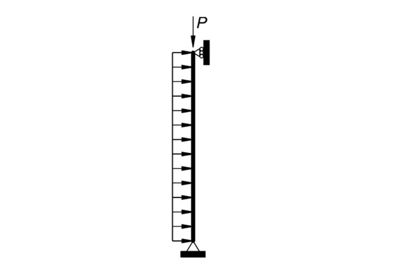

This example implements the benchmarks presented in Chapter C2 of the AISC steel manual commentary. 
The benchmarks consist of two cases:

- *Case 1* involves a simply supported column with a constant uniformly distributed transverse load, and a monotonically increasing axial force. This case only involves $P-\delta$ effects. It adds shear effects to Case 3 of [0007](../frame-0007/).
- *Case 2* involves a cantilever column with a constant transverse load at the tip and an increasing axial force. This problem involves both $P-\Delta$ and $P-\delta$ effects, and adds to Case 1 of [0007](../frame-0007/) the effect of shear.

## Section

In both cases the cross section is a *W14x48* wide flange shape. Note the approximation of the shear areas $A_y$ and $A_z$:
```python
d  = 13.75*inch
b  = 8.030*inch
tw = 0.340*inch
tf = 0.595*inch
transform = "Corotational"
section = dict(
        E  = 29000.0,
        G =  11200.0,
        A  = 14.1*inch**2,
        J  = 1.45*inch**4,
        Iy = 51.4,
        Iz = 484.0,
        Ay = d*tw,
        Az = b*tf*2,
        Cw = 2240*inch**6
)
```

## Case 1

In *Case 1*, a uniformly distributed load of $0.2$ kip/ft is first applied to the elements.

$$
\boldsymbol{q}_0 = \frac{wL^2}{12}\begin{pmatrix}
1 \\ -1
\end{pmatrix}
= \frac{wL^2}{12}\begin{pmatrix}
1 \\ -1
\end{pmatrix}
$$


## Case 2


$$
u_y = H L^3/(3 E I) +  H L/(\kappa G A)
$$