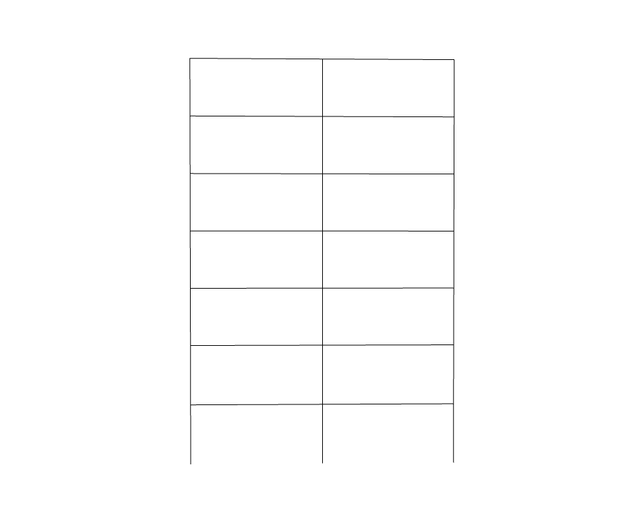

Used in verification by SAP2000 and seismo-struct (Example 10).

# References

- SAP2000 Integrated Finite Element Analysis and Design of Structures, Verification Manual, 
  Computers and Structures, 1997. Example 1.

- SeismoStruct, Verification Report For Version 6, 2012. Example 11.

