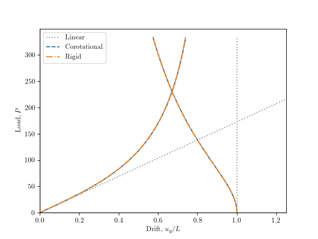

## Delta Geometry

## Exact Geometry

In this case the cantilever beam is subjected only to a transverse force
of $\boldsymbol{F} = 10 \, \mathbf{E}_2$ in a single step. 
The simulation uses the following geometric and material properties from the
literature: 

$$
\begin{array}{lr}
L  =&    1 \\
E  =&   10 \\
\hphantom{.}
% G  =   GAv/A
\end{array}
\qquad 
\begin{array}{lr}
A  =&   10^7 \\
I  =&    1   \\
J  =&   10^7 \\
\end{array}
$$

Two values for the shear modulus $G$ are used with a shear
stiffness $GA$ of $500$ and $10$, respectively, the latter representing
the case with significant shear deformations.
Table (#tab:transv) presents the numerical tip displacements and the
analytic solution from <cite key="batista2016closedform"></cite> using Jacobi elliptic
functions and accounting for flexural and shear deformations. The
analysis uses both 2-node and 4-node elements. For the sake of brevity,
the results are reported only for the variants using the same
parameterization as the wrapped element's interpolation.

## References

