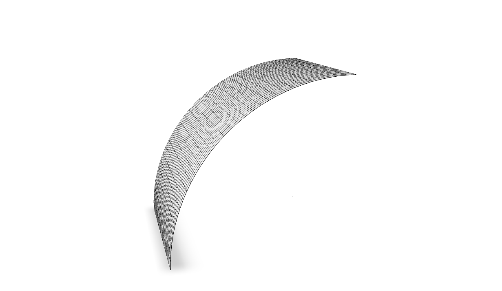

For $\nu = 0.3$, $R/t = 100$, $L/R = 2$ displacement under load is  $164.24 \, P / (E  t)$.

# References

- Lindberg, G. M. M., D. Olson, and G. R. Cowper, "New Developments in the Finite Element
  Analysis of Shells", Quarterly Bulletin of the Division of Mechanical Engineering and the National
  Aeronautical Establishment, National Research Council of Canada, vol. 4, 1969.

