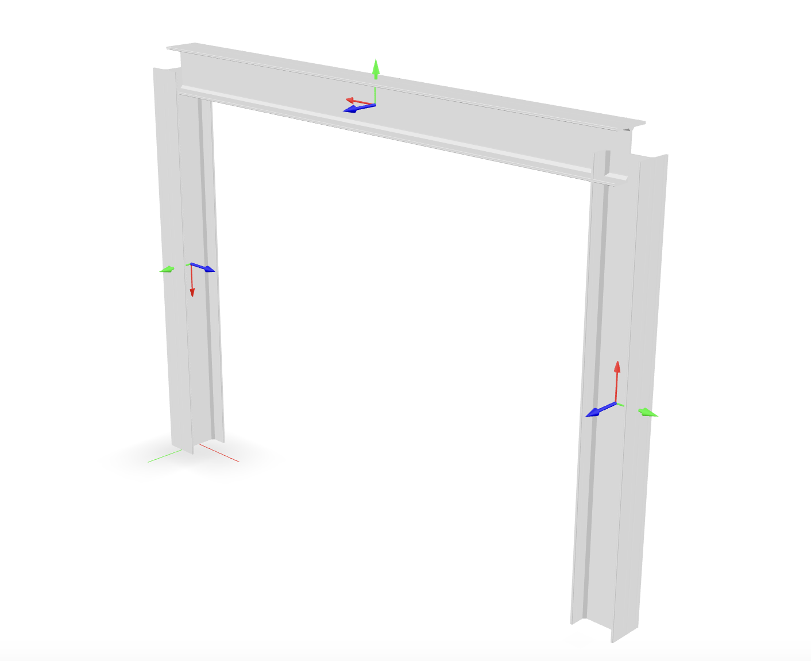

<!--  -->

The objective of this example is to demonstrate how to orient beam elements in 3D space. 
The model we'll build is a simple 3-element portal frame with wide-flange sections. 
Only certain relevant pieces of code will be shown in detail, but the full example script can
be downloaded from the link above.
In order to cover a wide range of cases, we'll orient the first column, element `1`, such that the strong axis of it's section bends *outside* the plane of the portal, the strong axis of the second column, element `3`, will resist bending *inside* the portal plane (See the image above).
We'll build two variations of the model; one where the 2nd coordinate is vertical, and another
with the 3rd coordinate vertical.
For the first case with \(X_2\) vertical we have:
```python
model.node(1, (    0,      0, 0))
model.node(2, (width,      0, 0))
model.node(3, (width, height, 0))
model.node(4, (    0, height, 0))

model.geomTransf("Linear", 1, (1, 0, 0))
model.geomTransf("Linear", 2, (0, 1, 0))
model.geomTransf("Linear", 3, (0, 0, 1))
```
and for \(X_3\) vertical:
```python
model.node(1, (    0, 0,      0))
model.node(2, (width, 0,      0))
model.node(3, (width, 0, height))
model.node(4, (    0, 0, height))

model.geomTransf("Linear", 1, (1, 0, 0))
model.geomTransf("Linear", 2, (0, 0, 1))
model.geomTransf("Linear", 3, (0,-1, 0))
```

Everything else is identical for both cases. The material is a simple
*ElasticIsotropic* formulation and for the section we'll use the `shps` package
to build a fiber discretization of a wide-flange:

```python
model.material("ElasticIsotropic", 1, 29e3, 0.3)

shape = WideFlange(d=8*inch, b=6.5*inch, tw=0.5*inch, tf=0.5*inch)
model.section("ShearFiber", 1)
for fiber in shape.create_fibers(origin="centroid"):
    model.fiber(**fiber, material=1, section=1)
```
