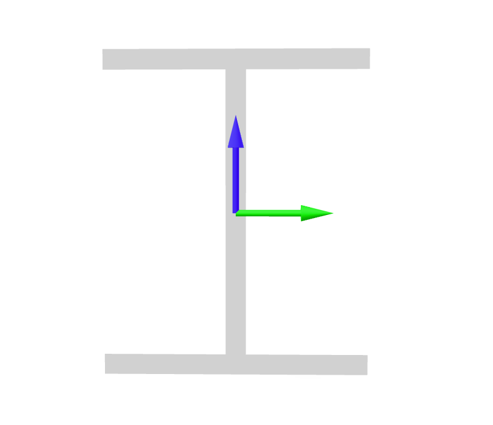

<!--



-->

<!--  -->

The objective of this example is to demonstrate how to orient beam elements in 3D space. 
The model we'll build is a simple 3-element portal frame with wide-flange sections. 

<figure style="text-align: center;">

</figure>

In order to cover a wide range of cases, we'll orient the first column, element `1`, such that the strong axis of it's section bends *outside* the plane of the portal, the strong axis of the second column, element `3`, will resist bending *inside* the portal plane (See the image above).

{}

In OpenSees, it is up to the analyst to choose which coordinate represents the vertical direction in their model. 
In this example we'll build two variations of the model corresponding to the most commonly used conventions: First we'll take the 2nd coordinate \(X_2\) as vertical, then the 3rd coordinate \(X_3\) vertical.
In both cases we begin by initializing a [`Model`](https://xara.so/user/manual/model/model_class.html) in `ndm=3` dimensions with `ndf=6` degrees of freedom per node:
```python
import xara
model = xara.Model(ndm=3, ndf=6)
```

## Orientation

Now we create the nodes and [geometric transformations](https://xara.so/user/manual/model/geomTransf.html), which
allows us to specify the exact orientation of frame elements in 3D.
For the first case with \(X_2\) vertical we have:


{}
```python
model.node(1, (    0,      0, 0))
model.node(2, (width,      0, 0))
model.node(3, (width, height, 0))
model.node(4, (    0, height, 0))

model.geomTransf("Linear", 1, (1, 0, 0))
model.geomTransf("Linear", 2, (0, 1, 0))
model.geomTransf("Linear", 3, (0, 0, 1))
```
{}
{}
```tcl
node 1      0       0  0
node 2 $width       0  0
node 3 $width $height  0
node 4      0 $height  0
geomTransf "Linear" 1  1 0 0
geomTransf "Linear" 2  0 1 0
geomTransf "Linear" 3  0 0 1
```
{}

and for \(X_3\) vertical:

{}
```python
model.node(1, (    0, 0,      0))
model.node(2, (width, 0,      0))
model.node(3, (width, 0, height))
model.node(4, (    0, 0, height))

model.geomTransf("Linear", 1, (1, 0, 0))
model.geomTransf("Linear", 2, (0, 0, 1))
model.geomTransf("Linear", 3, (0,-1, 0))
```
{}
{}
```tcl
node 1       0  0       0
node 2  $width  0       0
node 3  $width  0 $height
node 4       0  0 $height

geomTransf "Linear"  1   1  0  0
geomTransf "Linear"  2   0  0  1
geomTransf "Linear"  3   0 -1  0
```
{}


Everything else is identical for both cases. The material is a simple
*ElasticIsotropic* formulation 

```python
from xara.units.fps import inch, ksi
model.material("ElasticIsotropic", 1, E=29e3*ksi, nu=0.3)
```

For the section we'll use the `shps` package
to build a fiber discretization of a wide-flange:

```python
from shps.shapes import WideFlange

shape = WideFlange(d=8*inch, b=6.5*inch, tw=0.5*inch, tf=0.5*inch)
model.section("ShearFiber", 1)
for fiber in shape.create_fibers(origin="centroid"):
    model.fiber(**fiber, material=1, section=1)
```

## Validation

For this simple linear-elastic problem, it is straight forward to compute an exact solution.
Direct assembly of element stiffness furnishes:

$$
\boldsymbol{K} = \left[\begin{array}{ccc}
\frac{12}{H^3} ( EI_1 + EI_2)
& \frac{6}{H^2}  EI_1 
& \frac{6}{H^2}  EI_2 \\
  \frac{6}{H^2}  EI_1
& \frac{4}{L}    EI_g+\frac{4}{H} EI_1
& \frac{2}{L}    EI_g \\
  \frac{6}{H^2}  EI_2
& \frac{2}{L}    EI_g 
& \frac{4}{L}    EI_g + \frac{4}{H} EI_2 \\
\end{array}\right]
$$
