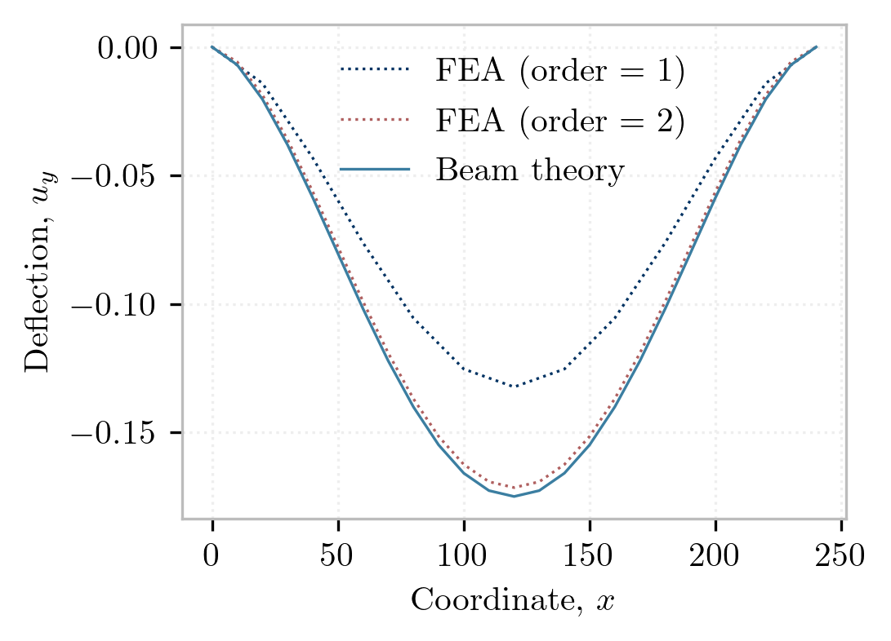

This example introduces mesh-building tools for solid modeling. 
A finite element analysis is performed of a plane beam with a hole using various Lagrange quadrilaterals. 
Visualization is performed using the [`veux`](https://veux.io) library.

## Creating Blocks

### Preliminaries

Before generating elements, we'll first prepare our *Model* by defining an appropriate material and section. 
Each node of the analysis has two displacement degrees of freedom. Thus the model is defined with
`ndm = 2` and `ndf = 2`.


{}
```python
import opensees.openseespy as ops

model = ops.Model(ndm=2, ndf=2)
```
{}
{}
```tcl
model -ndm 2 -ndf 2
```
{}


As with the example of a [tapered beam](../planetaper/), the [ElasticIsotropic](https://xara.so/user/manual/material/ndMaterials/ElasticIsotropic.html) material model is employed.

```python
E = 4e3
nu = 0.25 # Poisson's ratio
model.material("ElasticIsotropic", 1, E, nu, 0)
model.section("PlaneStress", 1, 1, 1.0)
```

### Quadrilateral Meshes

Next a mesh of quadrilateral elements is generated.
The `surface` method is used as follows:

```python
mesh = model.surface((nx, ny),
                  element=element,
                  args={"section": 1},
                  order=order,
                  points={
                    1: [  0.0,   0.0],
                    2: [   L,    0.0],
                    3: [   L,     d ],
                    4: [  0.0,    d ]
            })
```
where:
- `element` is a string variable containing the name of the element type to generate.
- `order` is an integer indicating the polynomial order of the generated elements; `order=1` will create standard 4-node quadrilaterals, and `order=2` will generate quadratic 9-node quadrilaterals.
- `nx` and `ny` are integers indicating how many elements to create in the $x$ and $y$ directions.
- `args` is a Python dictionary of arguments to be passed to each generated element. In this case the `"section"` keyword is used.



### Analysis


### Validation

Consider the equilibrium differential equations for a 2D Timoshenko beam:

$$
\begin{gathered}
 A G k_s\left( u_y'+\theta\right) - EI \theta'' =0 \\
-A G k_s\left(u_y''+ \theta'\right)=\bar{w}
\end{gathered}
$$

This is a coupled ODE for the displacement $u_y(x)$ and cross-section rotation $\theta(x)$. 
The boundary conditions for this problem are

$$
u_y(0)=0, \quad \theta(0)=0, \quad u_y(L)=0 \quad \theta(L)=0
$$

and the solution is:

$$
u_y(x)=\frac{q_0 L^4}{24 E I^{}} \frac{x^2}{L^2}\left(1-\frac{x}{L}\right)^2-\frac{1}{k_s G A}\frac{q_0 L^2}{24} \left(1-12 \frac{x}{L}+12 \frac{x^2}{L^2}\right) + \frac{1}{G A k_s L^2} \frac{q_0 L^4}{24}
$$

This is plotted below along with the results of the finite element analysis with 4 and 9-node quadrilaterals:



## Combining Blocks


Now we will perform the same simulation, but with a hole cut into the beam. 
The `shps` package gives us more detailed control over the mesh generation process. The `create_block` function has the same basic functionality as the `block2D` method, but it doest actually add elements or nodes to a `Model`. Instead, it returns generated node coordinates (`nodes`) and cell connectivities (`cells`) as follows:
```python
from shps import plane
from shps.block import create_block
points  = {
        1: (    0.0,   0.0),
        2: (L/2-w/2,   0.0),
        3: (L/2-w/2, d/2-h/2),
        4: (    0.0, d/2-h/2),
}
nodes, cells = create_block(ne, element, points=points)
```
It also exposes a `join` keyword argument which appends the generated nodes and cells to a given set of preexisting nodes and cells:
```python
points  = {
        1: (L/2+w/2,   0.0),
        2: (   L   ,   0.0),
        3: (   L   , d/2-h/2),
        4: (L/2+w/2, d/2-h/2),
}
other = dict(nodes=nodes, cells=cells)
nodes, cells = create_block(ne, element, points=points, join=other)
```
This checks for duplications, and only adds nodes where none existed before. The following complete script is used to perform the complete simulation.


