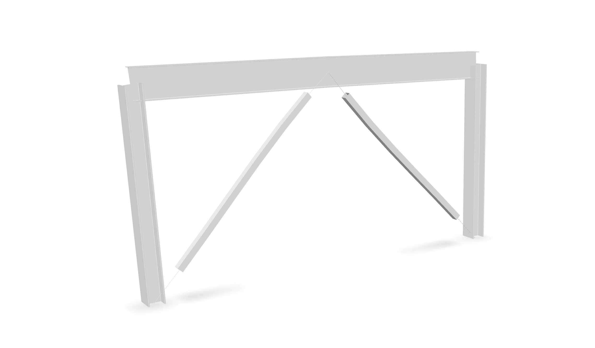
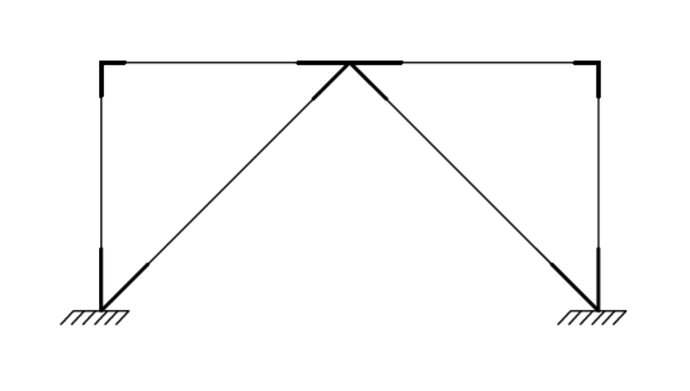
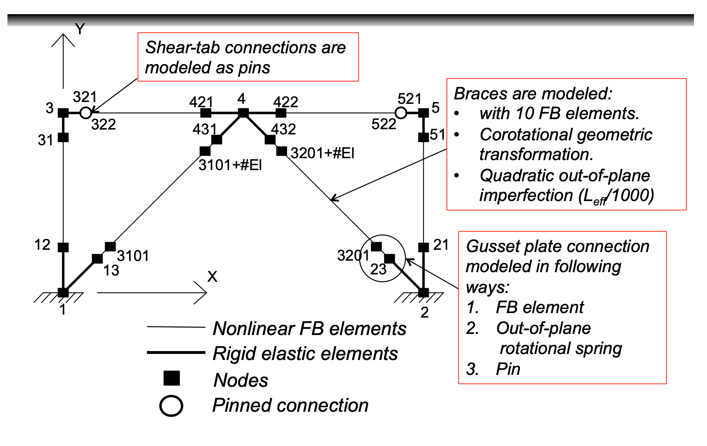

<!-- 
T1 = 0.1784712686027824 s
T2 = 0.10228366994425726 s 
-->

This investigation is adapted from <a rel="nofollow" href="https://opensees.berkeley.edu/wiki/images/d/de/ModelingSCBF.pdf">this</a> presentation by Vesna Terzic.
It concerns a concentrically braced steel frame.

