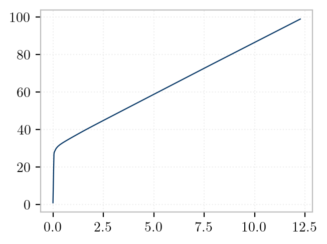

<!-- 
T1 = 0.1784712686027824 s
T2 = 0.10228366994425726 s 
-->

This investigation is adapted from <a rel="nofollow" href="https://opensees.berkeley.edu/wiki/images/d/de/ModelingSCBF.pdf">this</a> presentation by Vesna Terzic.
It concerns a concentrically braced steel frame.


<!--

-->

This example models a single-story portal frame with concentric bracing, as shown in the figure above. 
Inelastic behavior is captured using force-interpolating beam-column elements with fiber section discretizations. 
The analysis consists of a lateral pushover procedure.

The purpose of this example is to demonstrate nonlinear finite element modeling with OpenSees, including:

- Defining custom fiber sections based on AISC profiles
- Modeling gusset plates and braces using multiple elements
- Performing a pushover analysis
- Visualizing the progression of deformations with `veux`

## Model

We begin by creating a `Model` in 3D space, with 6 degrees of freedom per node:

```python
import opensees.openseespy as ops

model = ops.Model(ndm=3, ndf=6)
```

All sections share a single inelastic material definition:

```python
E = 29e3 * ksi
fy = 50 * ksi
nu = 0.3

model.nDMaterial("J2BeamFiber", 1, E, nu, fy, 0.01*E, 0.0)
```

The portal frame is constructed from AISC wide flange sections, with braces composed of HSS members.
Fiber sections are created using predefined shapes from the `shps` library (see, e.g., [this](https://gallery.stairlab.io/examples/framevecxz/) example), and assigned to
force-based frame elements.

The portal frame is assembled using three helper functions:

```python
# Create section and elements for girder
create_girder(model, (3, 4), tags)

# Create columns
create_column(model, (1, 3), tags)
create_column(model, (2, 5), tags)

# Create braces with gusset offsets
create_brace_fixed(model, (1, 4), tags)
create_brace_fixed(model, (2, 4), tags)
```

Each function encapsulates repeated modeling logic for structural members. 
In each function, a fiber section is populated using the `create_fibers()` method from the AISC shape object,
with a `mesh_scale` that controls the granularity of the fiber discretization.

### `create_girder`

This function defines a single beam element between two nodes. Internally, it performs three tasks:

1. **Creates a new fiber section** using a `W27x84` shape:
   ```python
   from shps.shapes import from_aisc
   shape = from_aisc("W27x84", units=units)
   model.section("ShearFiber", tag)
   for fiber in shape.create_fibers(origin="centroid", mesh_scale=1/2.5):
       model.fiber(**fiber, material=1, section=tag)
   ```

2. **Defines a force-based element** of type `ForceFrame` connecting the provided node pair:
   ```python
   model.element("ForceFrame", tag, nodes, section=tag, transform=2)
   ```

3. **Updates tags** in the shared `tags` dictionary to maintain unique identifiers.


Note that girders are oriented horizontally, so `transform=2` uses the Y-axis as the local element axis.


### `create_column`

This function defines a vertical column, again with a fiber-discretized cross section:

1. **Uses a `W14x176` shape** to build a `ShearFiber` section with mesh resolution scaled by the smallest dimension.

2. **Creates a `ForceFrame` element** aligned vertically:
   ```python
   model.element("ForceFrame", tag, (i, j), section=tag, transform=1)
   ```

3. Like the girder, it tracks all tag assignments centrally via `tags`.


### `create_brace_fixed`

This helper is more involved. It models a brace that connects to beam-column joints through **rigid gusset elements** and **a subdivided flexible core**. It does the following:

1. **Creates a new section** from an `HSS10x10x5/8` shape.

2. **Offsets the brace connections** using gusset-like rigid segments:
   - Node offsets are applied at each end based on the geometry:
     ```python
     xi + offset[0] * slope
     xj - offset[1] * slope
     ```

3. **Creates the following nodes and elements:**

   - 2 `ForceFrame` elements at the ends represent rigid gusset plates.
   - 5 `PrismFrame` elements in the center model the flexible HSS brace.


## Loads

Lateral loads are applied to node `3`, which is located at the top of the left column:

```python
model.pattern("Plain", 1, "Linear", loads={
  3: (50*kip, 0, 0,    0, 0, 0)
})
```

A `"LoadControl"` integrator is used to incrementally increase the load:

```python
model.integrator("LoadControl", 1)
model.test("NormDispIncr", 1.0e-8, 20, 0)
model.analysis("Static")
```

## Pushover Procedure

The pushover proceeds in small load steps, recording the horizontal displacement
of node `5` (the top right column) and corresponding base shear:

```python
u = []
p = []

for i in range(1, 100):
    if model.analyze(1) != 0:
        break
    u.append(model.nodeDisp(5, 1))  # horizontal displacement
    p.append(model.getTime())      # load factor
```

The resulting pushover curve is plotted using `matplotlib`:

```python
plt.plot(u, p)
plt.xlabel("Roof Displacement")
plt.ylabel("Base Shear")
```



## Visualization

The structure is rendered and animated using `veux`. Deformations are visualized
step-by-step during the pushover:

```python
artist = veux.create_artist(model, vertical=2)
motion = Motion(artist)

motion.advance(time=model.getTime()/50)
motion.draw_sections(rotation=model.nodeRotation, position=model.nodeDisp)
```

Once complete, the final state and motion history are served interactively:

```python
motion.add_to(artist.canvas)
veux.serve(artist)
```


