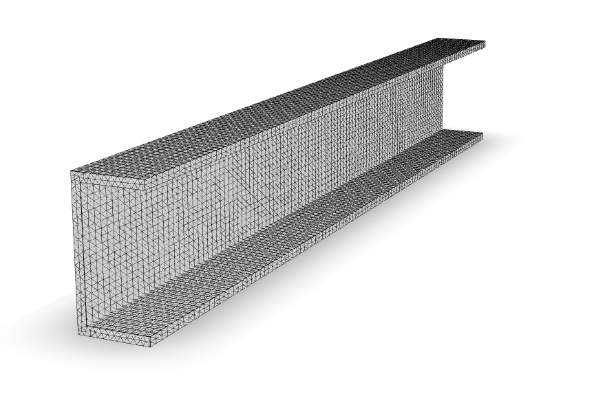
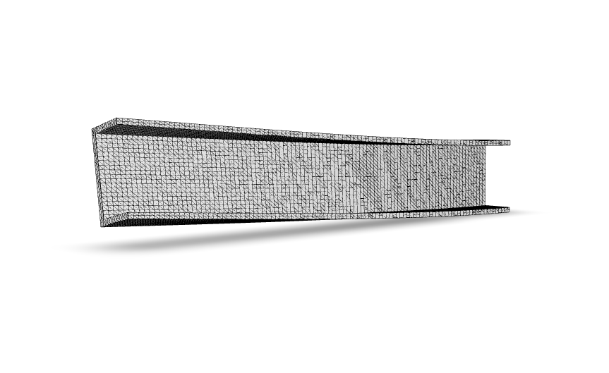

This investigation begins with a plane triangle mesh of a channel cross section. 
```python
from shps.shapes import Channel
mesh = Channel(d=16, b=8, tf=1.0, tw=1.0).create_shape(mesh_scale=0.75).mesh
```
Next we use the `ExtrudeTetrahedron` class which will generate node locations and connectivity for a tetrahedron mesh:
```python
from shps.frame.extrude import ExtrudeTetrahedron

ex = ExtrudeTetrahedron(mesh.nodes, mesh.cells())
```

Next we setup a `Model` instance for the 3D simulation:
```python
model = xara.Model(ndm=3, ndf=3)
model.material("ElasticIsotropic", 1, 29e3, 0.23)
model.pattern("Plain", 1, "Linear")
```
And finally we perform `n = 100` extrusions:
```python
n = 100
for i in range(n):
    for tag, coords in ex.nodes():
        model.node(tag, tuple(coords))
        if i==0 and coords[-1] == 0:
            model.fix(tag, (1, 1, 1))
        elif i == n-1:
            model.load(tag, (0, -1, 0), pattern=1)

    for tag, cell in ex.cells():
        model.element("FourNodeTetrahedron", tag, tuple(cell), 1)

    ex.advance()
```
This will create the following finite element model, which is rendered with [veux](https://veux.io):



```python
model.integrator("LoadControl", 2)
model.system("Umfpack")
model.analysis("Static")
model.analyze(1)
```

After performing the analysis the deformed shape is rendered with:
```python
artist = veux.create_artist(model, ndf=3)
artist.draw_outlines(state=model.nodeDisp)
artist.draw_surfaces(state=model.nodeDisp)
```


