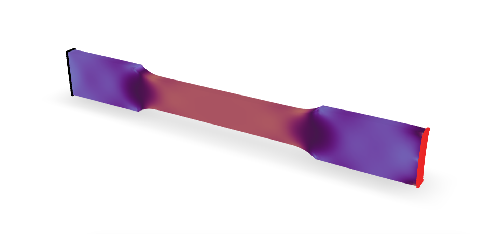

This example borrows an Abaqus input script for a metallic coupon that is used by the [Peridynamics.jl](https://kaipartmann.github.io/Peridynamics.jl/stable/generated/tutorial_tension_static/) library.

The trilinear 8-node brick element is used with a [$J_2$ plasticity](https://xara.so/user/manual/material/plastic/J2Plasticity.html) material.

